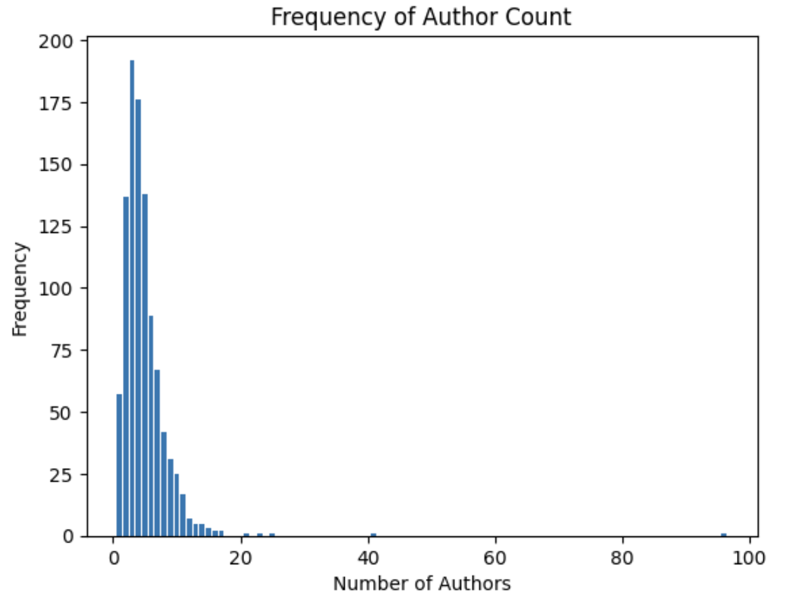
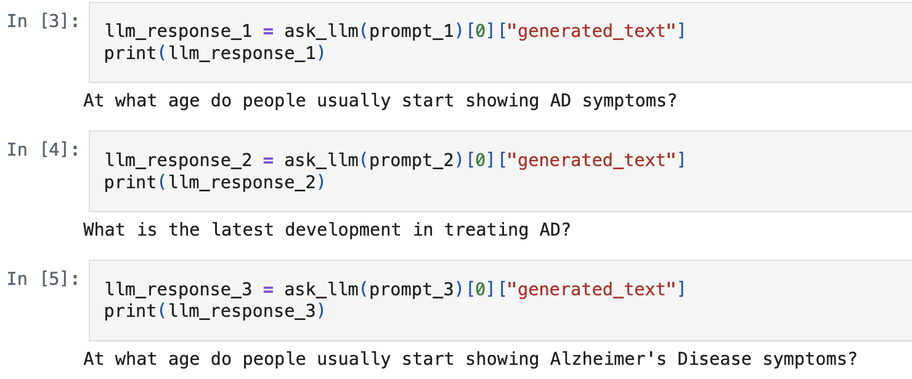

## Project Goal

Use **Retrieval-Augmented Generation (RAG)**-based LLM to answer questions based on long, unstructured documents, by retrieving relevant chunks. 


---

## Data: Alzheimer's Research

- Focus on **Alzheimer's disease** papers from [arXiv.org](https://arxiv.org/)
- Limited to **1,000 entries**
- Only **abstracts** used
- Collected via invoking [arXiv.org](https://arxiv.org/) API by using `parse.py` script 

---

## Data Wrangling and EDA

- Tokenized text and removed stop words using `nltk`
- Analyzed word frequency, author count, token length and publications per year


---

## Sample Insight

- Average authors per paper: **~5**
- Some papers had up to **96 authors!**




---

## Preprocessing & Modeling

### LLM Used:
- `TinyLlama-1.1B-Chat-v1.0`

### Sample Prompts:
```python
prompt_1 = "At what age do people usually start showing AD symptoms?"
prompt_2 = "What is the latest development in treating AD?"
prompt_3 = "At what age do people usually start showing Alzheimer's Disease symptoms?"
prompt_4 = prompt_3 + " Give me a number."
```
---

## Evaluation: RAG vs Non-RAG

### Answers Without RAG



---

## Preprocessing Pipeline

- Convert abstracts to `Document` format  
- Split using `SentenceSplitter` (LlamaIndex)  
- Vectorize using `all-MiniLM-L6-v2` (Hugging Face)

---

## Answers With RAG


---

## Limitations

- Used small models and limited data  
- No prompt engineering 

---


## Results & Future Work
- RAG improves accuracy and grounding  
- Scale to larger models and datasets  
- Experiment with:
  - Prompt engineering  
  - Context formatting  
  - Evaluation/comparison methods  
- Deploy in real-world QA settings
