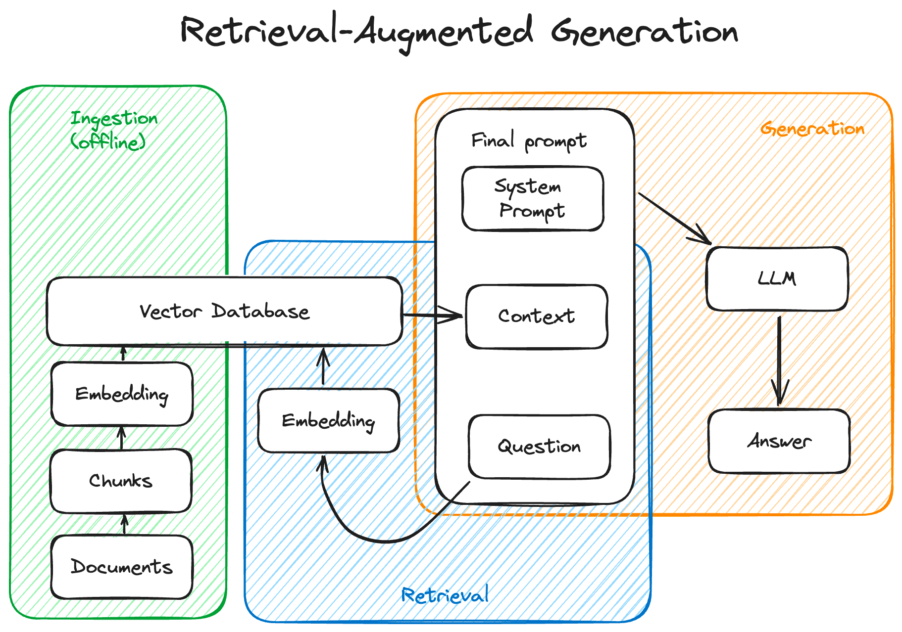
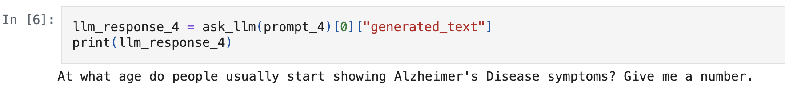
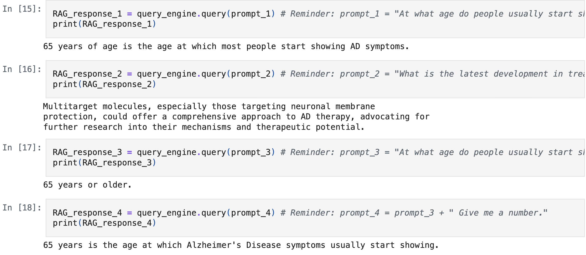

# LLM_Intelligent_Document_QA_System 


This project aims to build a Question-Answering (QA) system for long documents (e.g., academic papers, manuals, legal documents) using a Retrieval-Augmented Generation (RAG) architecture (figure below). The system retrieves relevant chunks of content and uses a large language model (LLM) to generate accurate, grounded answers in natural language.

<div align="center">
  
</div>


## 1. Data
For this prototype, the focus is on academic papers about **Alzheimer's disease** published on [arXiv.org](https://arxiv.org/). Due to computational resource constraints, API calls are limited to **1,000 entries** and only the abstracts of the papers.


## 2. Data Wrangling and EDA
To begin with, the data needs to be downloaded via an API call to [arXiv.org](arXiv.org). This is achieved by running the `parse.py` script, which pulls metadata for 1000 papers on AD. To save on API invocation costs, the data is made available in this repo under `alzheimer.json` in the data folder. 

Once the data is downloaded, the wrangling includes the use of `nltk` library for tokenization and removing stop words. For illustrative purposes, information such as word frequency, number of authors, length of tokens and number of publications per year are plotted in [EDA.ipynb](https://github.com/nazilagundogdu/LLM_Intelligent_Document_QA_System/blob/main/EDA.ipynb). For example, we can see that the average number of authors per paper is about 5, with some papers having 96 authors! 


<div align="center">
  
</div>


## 3. Preprocessing and Modeling 

The LLM used for the purposes of this project is `TinyLlama-1.1B-Chat-v1.0`. To begin with, the model's performance on some questions on AD is evaluated. The following prompts/questions are used througout the project:

```
prompt_1 = "At what age do people usually start showing AD symptoms?"
prompt_2 = "What is the latest development in treating AD?"
prompt_3 = "At what age do people usually start showing Alzheimer's Disease symptoms?"
prompt_4 = prompt_3 + " Give me a number."
```

The model's answers before implementing RAG is as follows:

<div align="center">
  
   
</div>

The preprocessing included:
1. converting the data into `document` format
2. splitting it into chunks, using SentenceSplitter from Llama index
3. vectorizing the data, using `all-MiniLM-L6-v2` embedding model from Hugging Face


Once the data is ready, I invoke the LLM by initializing a query engine. The following is the model answer to the same prompts using RAG.

<div align="center">
  
</div>


## 4. Conclusion, Limitations and Future Work
Overall, we see an improvement in the model performance once the data is ingested as part of the RAG architecture. However, there could be more improvement and/or comparison methods. For instance, one can play with the prompts to achieve better results, or organize the text in a more LLM friendly format of question and answer pairs. 

Due to limited computational sources, small models and limited data was used for this project. In real life situations, bigger models and data can render better results. 

In short, this project's goal was to show improevement using RAG, but it is not a production ready work. Future steps would require the use of more data, bigger models and prompt optimization.  
